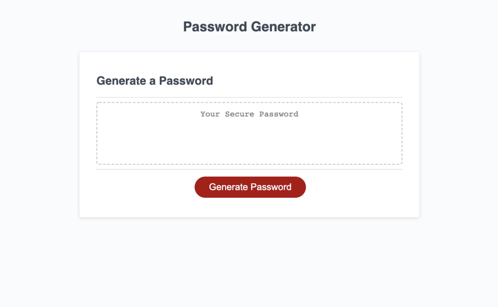
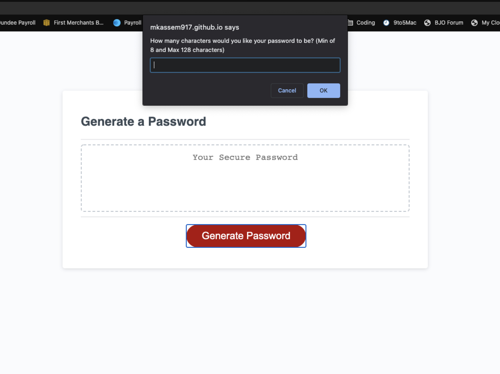

# password-generator
Week 3 Homework - Password Generator with JavaScript
   Link: https://mkassem917.github.io/password-generator/ 

**Description**

This script will allow you to create a password up to 128 characters in length with a minimum of 8 characters.

* One of the following criteria must be met 
    * have at least one - lowercase, uppercase, numerical   and special characters

**Contents:**

* index.html
* script.js
* style.css
* images folder - Contains screenshots
* README.md

**Tools Used:**

* w3schools website - help with .js code
* MDN website - help with .js code

 
    

